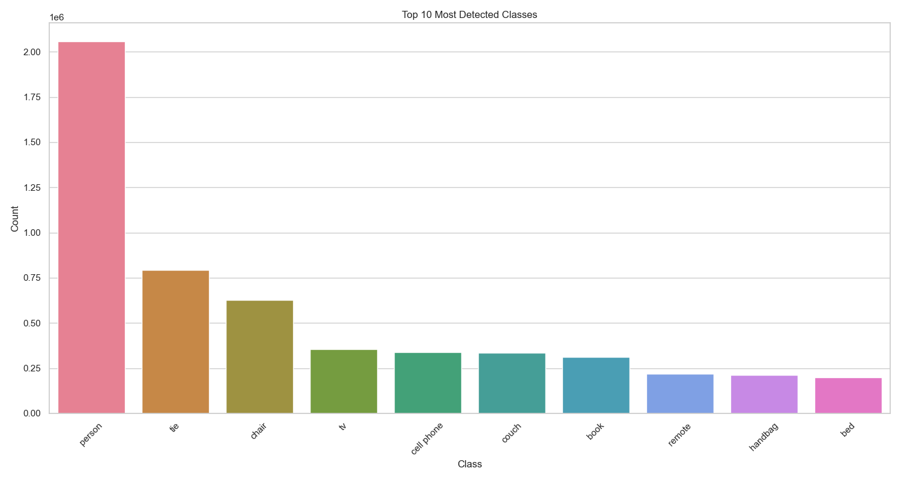
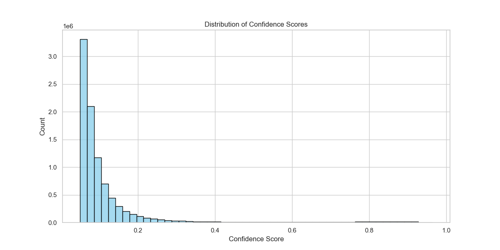

# RTMDet 目标检测模型测试报告

### 演示视频：https://box.nju.edu.cn/d/3244f5833a38493e8ad7/
### 数据集：https://vis-www.cs.umass.edu/lfw/lfw.tgz

## 0. 项目运行步骤

### 0.1 环境准备
```bash
# 创建并激活虚拟环境（推荐）
conda create -n rtmdet python=3.8
conda activate rtmdet

# 安装依赖
pip install -r requirements.txt
```

### 0.2 数据准备和处理
```bash
# 1. 运行数据增强脚本，生成带有干扰的测试图像
python scripts/data_augmentation.py
# 此步骤会：
# - 自动下载LFW数据集到 ../lfw.tgz
# - 解压数据集到 ../test_images/
# - 生成带有干扰的图像到 ../test_images_augmented/
# - 生成增强信息文件 augmentation_info.json
```

### 0.3 模型测试
```bash
# 2. 运行测试脚本
python scripts/test_RTMDet.py
# 此步骤会：
# - 自动下载预训练模型
# - 对原始和干扰后的图像进行目标检测
# - 在 result/ 目录下生成：
#   - test_report.md：详细的测试报告
#   - visualizations/：可视化结果
#   - test_results.json：原始测试数据
```

### 0.4 输出说明
- `augmentation_info.json`：记录了数据增强的详细信息
- `result/`：
  - `test_report.md`：包含完整的测试结果和分析
  - `visualizations/`：包含置信度分布图等可视化结果
  - `test_results.json`：包含原始的测试数据

## 1. 引言

### 1.1 项目背景
本项目旨在测试 RTMDet 目标检测模型在人脸图像数据集上的性能表现，特别关注其在不同图像干扰条件下的检测稳定性和鲁棒性。通过对大规模人脸数据集添加各种干扰因素进行测试，评估模型在实际应用场景中的可靠性。

### 1.2 测试目标
- 评估模型在原始图像上的基础检测性能
- 分析不同图像干扰对检测结果的影响
- 验证模型在不利条件下的检测稳定性
- 评估模型对各类干扰的鲁棒性
- 发现潜在的优化方向和改进空间

## 2. 测试设置

### 2.1 环境配置
- **硬件环境**：
  - GPU：NVIDIA GeForce RTX 4070 SUPER
  - CUDA：11.8

- **软件环境**：
  - Python：3.8
  - PyTorch：2.1.0
  - MMDetection：3.0.0
  - MMCV：2.1.0

### 2.2 模型配置
- **模型**：RTMDet-Ins Large
- **检测参数**：
  - 置信度阈值：0.3
  - 最大检测数量：20
  - 支持的类别：80个COCO数据集类别

### 2.3 测试数据
- 数据集：LFW (Labeled Faces in the Wild)
- 数据集来源：https://vis-www.cs.umass.edu/lfw/lfw.tgz
- 原始图片：13,233 张
- 干扰处理后的图片：119,097 张（每张原始图片生成9种不同干扰条件的变体）
- 总样本数：5,749 人

## 3. 测试方法

### 3.1 测试流程
1. **数据准备**：
   - 下载并解压LFW数据集
   - 对原始图像添加9种不同的干扰条件

2. **数据增强实现** (`data_augmentation.py`)：
   - 实现多种图像干扰方法：
     - 亮度变化（增强/减弱）：模拟不同光照条件
     - 遮挡模拟：模拟部分人脸被遮挡的情况
     - 高斯噪声（低/高强度）：模拟图像噪声干扰
     - 图像模糊（低/高强度）：模拟相机失焦或运动模糊
     - 图像旋转（左/右）：模拟不同拍摄角度
   - 使用多进程并行处理提高效率
   - 保存增强信息到JSON文件

3. **模型测试实现** (`test_RTMDet.py`)：
   - 加载预训练的RTMDet模型
   - 对原始和增强图像进行目标检测
   - 计算各种评估指标
   - 生成可视化结果和测试报告

### 3.2 评估指标
- **检测数量**：每张图片检测到的目标数
- **检测置信度**：检测结果的置信度分布
- **类别分布**：不同类别的检测频率
- **检测稳定性**：添加干扰前后检测结果的一致性
- **抗干扰能力**：模型对不同类型干扰的适应性

### 3.3 数据收集与分析
- 记录每张图片的检测结果
- 统计不同增强方法的效果
- 分析检测结果的分布特征
- 生成可视化图表辅助分析

## 4. 测试结果分析

### 4.1 整体性能
- 原始图片平均检测数：63.56 个目标/图
- 增强图片平均检测数：69.77 个目标/图
- 整体检测稳定性：1.10（增强后/原始的比值）

### 4.2 数据增强效果分析
各种干扰条件下的性能比较（按检测数量排序）：
1. 旋转增强效果最显著：
   - rotate_right：87.39 个目标/图
   - rotate_left：83.30 个目标/图
2. 中等影响的增强方法：
   - blur_high：67.09 个目标/图
   - bright：66.61 个目标/图
3. 影响较小的增强方法：
   - dark：62.08 个目标/图（最低）

### 4.3 检测类别分析

Top 5 最常检测到的类别：
1. person：2,056,128 次 (置信度：0.12 ± 0.12)
2. tie：793,053 次 (置信度：0.11 ± 0.12)
3. chair：627,941 次 (置信度：0.11 ± 0.11)
4. tv：355,337 次 (置信度：0.11 ± 0.11)
5. cell phone：337,663 次 (置信度：0.11 ± 0.11)

### 4.4 置信度分布分析

- 置信度主要集中在0.05-0.20区间
- 呈现明显的右偏分布
- 高置信度(>0.8)检测结果较少

### 4.5 检测稳定性分析
- 平均检测稳定性：1.24 ± 0.67
- 检测稳定性范围：0.64 - 20.56
- 典型案例：
  - 最稳定：Chang_Saio-yue (20.56)
  - 最不稳定：Kay_Behrensmeyer (0.64)

## 5. 主要发现

1. **增强效果**：
   - 数据增强总体上提高了模型的检测能力（稳定性>1）
   - 旋转增强特别有效，可能是因为提供了更多的视角信息
   - 模糊和亮度调整的效果相对温和

2. **检测特点**：
   - 模型倾向于检测人物及其相关物品（如领带、椅子等）
   - 检测结果的置信度普遍偏低，可能需要优化模型参数

3. **稳定性表现**：
   - 大多数情况下能保持稳定的检测效果
   - 个别案例的稳定性差异较大，需要进一步分析原因

## 6. 改进建议

1. **模型优化**：
   - 考虑提高置信度阈值，以获得更可靠的检测结果
   - 针对低置信度检测结果进行模型微调

2. **数据增强策略**：
   - 加强使用旋转增强，因为效果显著
   - 可以减少模糊和暗化增强的使用，因为效果相对较小

3. **应用建议**：
   - 在实际应用中，建议结合多种增强方法
   - 特别注意处理极端案例（稳定性过高或过低的情况）

## 7. 结论

RTMDet模型在人脸图像数据集上展现出了良好的检测能力和稳定性。通过数据增强，模型的检测能力得到了提升，特别是在处理旋转变化时表现突出。但模型在置信度方面还有提升空间，建议在实际应用中根据具体需求调整参数和增强策略。

